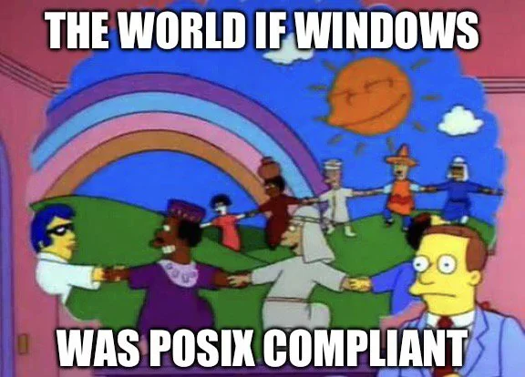

I was a student [here](https://cs.uchicago.edu/mpcs-pre-doctoral-program/).

I am interested in using tools from Group Theory and Topology
to design new NNs that are accessible.

I have laid claim to my corner of the Internet:
[michaelfortunato.dev](https://michaelfortunato.dev)

<!--
**michaelfortunato/michaelfortunato** is a ✨ _special_ ✨ repository because its `README.md` (this file) appears on your GitHub profile.

### Hi there 👋

Here are some ideas to get you started:

- 🔭 I’m currently working on ...
- 🌱 I’m currently learning ...
- 👯 I’m looking to collaborate on ...
- 🤔 I’m looking for help with ...
- 💬 Ask me about ...
- 📫 How to reach me: ...
- 😄 Pronouns: ...
- ⚡ Fun fact: ...
-->
